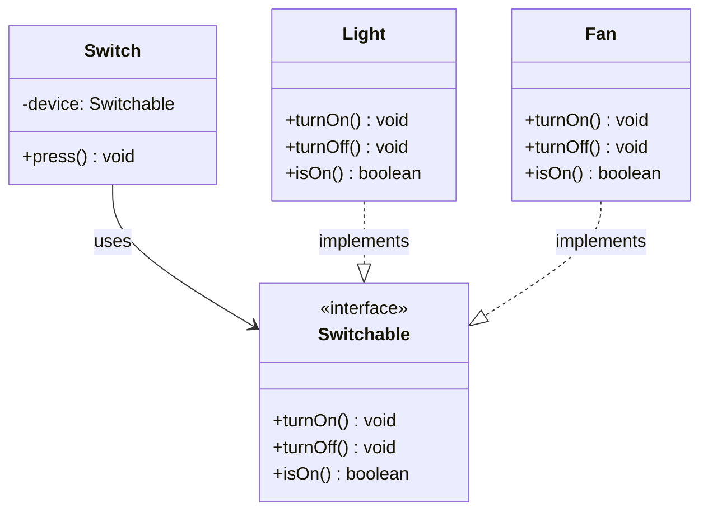

Hay un momento en la vida de todo desarrollador junior en el que escribe una clase, la conecta con otra, y piensa: *"esto funciona, estoy contento"*. Y tiene razón. Funciona. El problema llega tres semanas después, cuando hay que cambiar algo y de repente tocar una cosa rompe otras cinco.

Ese es el síntoma. La causa, muchas veces, es el acoplamiento. Y una de las herramientas más potentes para combatirlo se llama **Inversión de Dependencias**.

---

## El problema: cuando una clase sabe demasiado

Imagina que estás modelando un interruptor de luz. Algo simple: pulsas, se enciende. Pulsas de nuevo, se apaga.

Una primera implementación podría ser así:

```java
class ConcreteLight {
    public void turnOn() {
        System.out.println("Light on");
    }

    public void turnOff() {
        System.out.println("Light off");
    }
}

class Switch {
    private ConcreteLight light;  // ← Switch knows ConcreteLight exists
    private boolean isOn = false;

    public Switch() {
        this.light = new ConcreteLight();  // ← Switch creates the light
    }

    public void press() {
        if (isOn) {
            light.turnOff();
            isOn = false;
        } else {
            light.turnOn();
            isOn = true;
        }
    }
}
```

Funciona. Pero hay un problema oculto: **el Switch sabe que existe `ConcreteLight`**. Está hardcodeado dentro. Si mañana quieres que ese mismo Switch controle un ventilador, tienes que modificar `Switch`. Si quieres una SmartTV, modificas `Switch` de nuevo.

Cada nuevo dispositivo = modificar código que ya funcionaba. Eso es frágil.

---

## La raíz del problema: depender de lo concreto

El Switch está dependiendo de un *detalle de implementación*: una clase específica, con métodos con nombres específicos. Está acoplado a ella.

El principio de Inversión de Dependencias dice exactamente lo contrario:

> *Los módulos de alto nivel no deben depender de los módulos de bajo nivel. Ambos deben depender de abstracciones.*

Traducido al mundo real: el Switch no debería saber que existe `ConcreteLight`. Solo debería saber que lo que controla *puede encenderse y apagarse*. Nada más.

---

## La solución: depender de un contrato

Primero definimos la abstracción. Un contrato que dice: *"si implementas esto, puedes ser controlado por un Switch"*.

```java
interface Switchable {
    void turnOn();
    void turnOff();
    boolean isOn();
}
```

Ahora los dispositivos firman ese contrato:

```java
class Light implements Switchable {
    private boolean on = false;

    @Override
    public void turnOn() {
        on = true;
        System.out.println("💡 Light on");
    }

    @Override
    public void turnOff() {
        on = false;
        System.out.println("💡 Light off");
    }

    @Override
    public boolean isOn() {
        return on;
    }
}

class Fan implements Switchable {
    private boolean on = false;

    @Override
    public void turnOn() {
        on = true;
        System.out.println("🌀 Fan on");
    }

    @Override
    public void turnOff() {
        on = false;
        System.out.println("🌀 Fan off");
    }

    @Override
    public boolean isOn() {
        return on;
    }
}
```

Y el Switch ahora recibe la abstracción, no la clase concreta:

```java
class Switch {
    private final Switchable device;  // ← here is the inversion

    public Switch(Switchable device) {
        this.device = device;
    }

    public void press() {
        if (device.isOn()) {
            device.turnOff();
        } else {
            device.turnOn();
        }
    }
}
```

La inversión ocurre en el constructor. En vez de `ConcreteLight`, el tipo es `Switchable`. El Switch ya no sabe qué hay al otro lado. Solo sabe que cumple el contrato.

---

## La inyección: quién conecta las piezas

Ahora alguien tiene que decidir qué dispositivo va con qué Switch. Ese alguien es el **punto de composición**: el único lugar del código donde se conecta todo.

```java
// Composition Root: the only place that knows the details
Switch livingRoomSwitch = new Switch(new Light());
livingRoomSwitch.press();  // 💡 Light on

Switch deskSwitch = new Switch(new Fan());
deskSwitch.press();  // 🌀 Fan on
```

El acto de pasarle el dispositivo al Switch desde fuera se llama **inyección de dependencias**. No es magia ni un framework: es simplemente que alguien de fuera decide qué entra, en vez de que la clase lo cree internamente.

---

## Cómo queda la arquitectura



Fíjate en lo que no hay: ninguna flecha directa entre `Switch` y `Light`. No se conocen. Solo se comunican a través del contrato.

---

## Añadir un dispositivo nuevo: el test real

¿Quieres añadir un aire acondicionado? Solo creas la clase y firmas el contrato. No tocas `Switch`, no tocas `Light`, no tocas nada existente.

```java
class AirConditioner implements Switchable {
    private boolean on = false;

    @Override
    public void turnOn() {
        on = true;
        System.out.println("❄️ Air conditioner on");
    }

    @Override
    public void turnOff() {
        on = false;
        System.out.println("❄️ Air conditioner off");
    }

    @Override
    public boolean isOn() {
        return on;
    }
}

// And you can use it right away:
Switch livingRoomSwitch = new Switch(new AirConditioner());
livingRoomSwitch.press();  // ❄️ Air conditioner on
```

Ese es el poder real del principio. El sistema es **abierto a la extensión, cerrado a la modificación**.

---

## Conclusión

La Inversión de Dependencias no es un concepto complicado. Es una decisión de diseño que se resume en una frase:

**Depende de lo que hace, no de quién lo hace.**

Cuando el Switch depende de `ConcreteLight`, está acoplado a un *quién*. Cuando depende de `Switchable`, está acoplado a un *qué*. Y eso cambia todo: el código se vuelve extensible, testeable y mantenible.

La próxima vez que escribas una clase y veas que dentro hace un `new ConcreteClass()`, pregúntate: *¿necesito saber que es esta clase concreta, o me basta con saber qué puede hacer?*. Esa pregunta, repetida a lo largo de un proyecto, es la diferencia entre un código que escala y uno que se convierte en un castillo de naipes.
